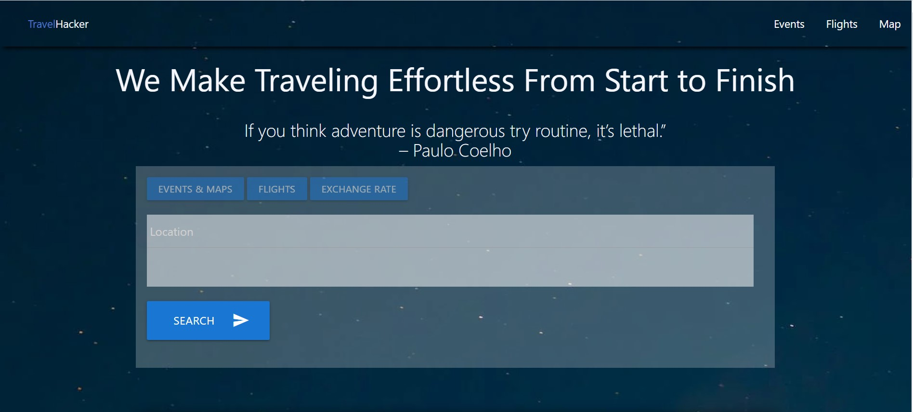

# Travel hacker

## About Our Project

Welcome to Travel Hacker!
Our project would center on traveling. The idea of the website is to revolve around having different components to help your travel be effortless from start to finish. Our company has narrowed down the basics to our traveling website. Including, exchange rate, news/events trending, lodge (our focus on Airbnb), and the latest statistics on your flight information. Our mission is to absolve this part of your trip and have you worry about the things that deserve more of your attention.\

## Getting Started

We are minimizing the time and simplicity of looking up Events, Flights, Maps, and Exchange Rates.
Input the location to get popular events nearby.
Input the location you’re trying to find the cheapest flights to.
Input the location to see a map.
Input the currency you would like to obtain the exchange rate.
Future Enhancements
Add restaurants suggestions with ratings in the local area
Create a function to compare locations and select the nearest city
Refactor for cleaner/shorter code
Add drop pin on maps to show the current location

## Demo



##Links
Deployed: https://github.com/bekkanunez/Travel_Hacker
GitHub Repo: https://bekkanunez.github.io/Travel_Hacker/

## Technologies

This section includes all the frameworks we built our project with:


```
APIs:
Google Maps
Ticketmaster
Rapid API
Exchange Rate
Flights Statistics
```

## License

MIT License
